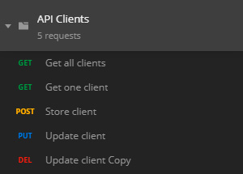

# API RESTful

***API - Application Programming Interface***
 Consiste em um conjunto de rotinas e padrões estabelecidos por uma aplicação para que outras aplicações possam utilizar suas funcionalidades.

- Responsável por estabelecer comunicação entre serviços.
- Meio de campo entre tecnologias.
- Intermediador para troca de informações.

 ***REST - Representational State Transfer***
 Delimita algumas constraints (obrigações) na transferência de dados.

- *Client-Server*: separação do cliente e do armazenamento de dados, possibilitando a portabilidade do sistemas
- *Stateless*: cada requisição deve conter todas as informações necessárias para o servidor entender e responder a requisição (Response and Request)
- *Cacheable*: respostas da requisições devem deixar explícito se elas podem ser cacheadas pelo client.
- *Layered System*: o cliente acessa um endpoint sem a necessidade de conhecer a complexidade necessária para o servidor responder a requisição.
- *Code on demand (opcional)*: possibilita às aplicações pegar códigos e executar no cliente

 ***Verbos HTTP***

- *GET*: Receber dados de um Resource.
- *POST*: Enviar dados para serem processados em um Resource.
- *PUT*: Atualizar dados de um Resource.
- *DELETE*: Deletar dados de um Resource.

## Tools

**Postman**, para teste de requisições:
 